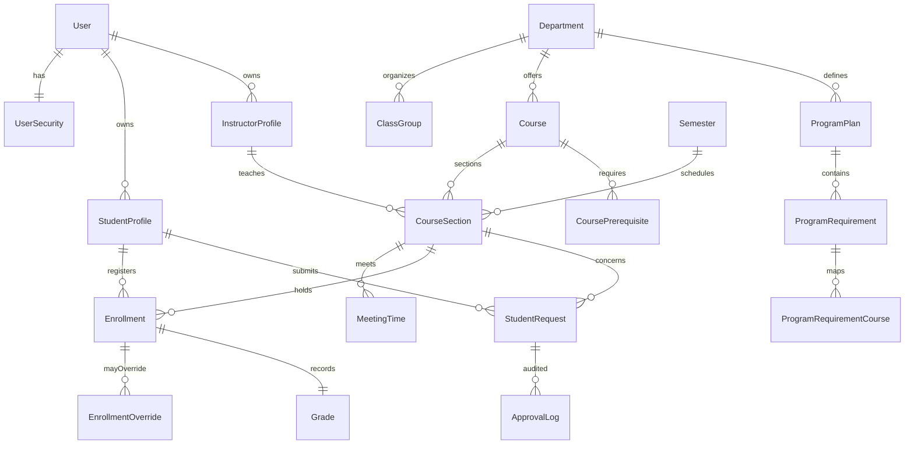

# 课程设计报告：大学选课与成绩管理数据库系统

## 1. 问题建模与需求概述
- **核心目标**：集中管理学生、教师、课程、教学班、选课、成绩、先修、审批与培养方案数据，支撑选课、退课、重修、跨院审批、时间冲突检查与 GPA 统计。
- **关键业务规则**：
  1. 每名学生分配唯一学号，关联院系/专业与联系方式。
  2. 课程有唯一课程代码与课程类型；教学班与学期、教师关联并受容量/时间表约束。
  3. 教师同一时间段只能授课一门课；教学班可设置上课时间并进行冲突检测。
  4. 选课记录包含状态、成绩、绩点，支持容量、先修、时间冲突、重修豁免审批。
  5. 学生学期学分需在 10–40 之间，超/低学分需审批后才能导出课表。

## 2. ER 建模

## 3. 表结构设计（关键字段与主键）
- **学生** (`students` / `StudentProfile`): PK 自增；`student_number` 非空唯一并自动生成；外键指向院系、班级、用户；存储性别、生日、联系方式、专业信息。
- **教师** (`instructors` / `InstructorProfile`): PK；`user_id` 唯一；院系外键 PROTECT，防止教师自行变更归属。
- **课程/教学班** (`courses`, `course_sections`, `section_meetings`): 课程代码唯一；教学班唯一键 `(course_id, semester_id, section_code)`；容量/候补容量非负；上课时间校验 `end_time > start_time`，教师排课冲突在 `MeetingTime.clean` 中检测。
- **培养方案** (`program_plans`, `program_requirements`, `program_requirement_courses`): 以方案->要求->课程的分级结构记录类别学分、建议修读学期与选课窗口。
- **先修课** (`course_prerequisites`): 复合主键 `(course_id, prereq_course_id)`；最低成绩枚举。
- **选课与成绩** (`enrollments`, `grades`): 选课唯一键 `(student_id, section_id)`；状态枚举（enrolling/dropped/passed/failed）；存储最终成绩与绩点；`grades` 表在演示库中用于成绩填报与 GPA 计算。
- **审批** (`student_requests`, `approval_logs`, `enrollment_overrides`): 记录重修、跨院、超学分等申请与审批动作，并允许针对容量/先修/时间冲突/重修的豁免。

## 4. 代码实现简介
- **Django 后端**（目录 `registrar/`）
  - 使用模型约束唯一性和外键行为；`MeetingTime.clean` 做教师排课冲突校验；`CourseSection` 自动分配教学班号；`StudentProfile.save` 自动生成学号。
  - 管理后台提供用户/课程/教学班/先修/选课/审批等 CRUD 及成绩锁定。
- **CLI 演示工具**（`app.py`）
  - 基于 SQLite 构建与 Django 对齐的 schema 和样例数据。
  - 提供 `transcript`、`prereq`、`conflict`、`credit-load`、`capacity`、`pass-rate`、`gpa-distribution` 命令，用于验证先修、时间冲突、学分上下限、容量与绩点统计。
- **SQL 脚本**（`sql/schema.sql` / `sample_data.sql` / `queries.sql`）
  - DDL 与样例数据覆盖院系、课程、先修、培养方案、审批、成绩等实体。
  - 查询脚本包含成绩单、先修校验、时间冲突、学分范围、容量、通过率、GPA 分布等常用统计。

## 5. 程序效果展示
- **成绩与 GPA**：`python app.py transcript alice` 输出学期课程、成绩、绩点与累计 GPA。
- **先修/时间冲突检查**：`python app.py prereq alice CSE200`、`python app.py conflict alice 2` 分别展示缺失先修与冲突的教学班列表。
- **学分上下限**：`python app.py credit-load alice 2025FALL` 返回学分总数及 OK/OUT_OF_RANGE 状态。
- **审批记录**：在 Admin 中新增/审批学生申请后，审批日志自动生成，便于审核追踪；容量/时间/先修豁免可通过 `EnrollmentOverride` 登记。

## 6. 后续可扩展方向
- 增加教室/楼宇容量管理，与教学班时间表联动占用检查。
- 针对成绩变更添加审计触发器或版本化记录；在 GPA 计算中加入重修课程替换规则。
- 提供 REST/GraphQL API 供前端或第三方系统集成；为通知、消息和批量导入添加独立模块。
