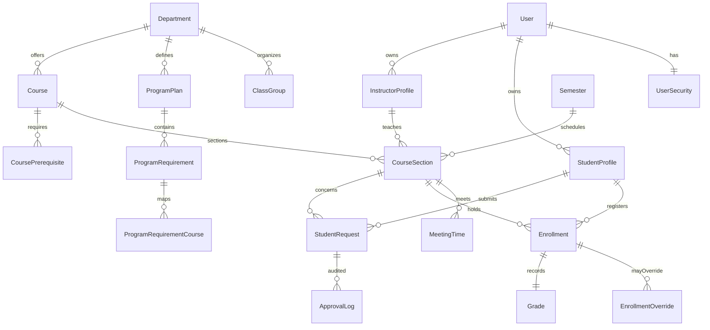

# University Course Registration and Grade Management Database Design

This document aligns the Django models, the ANSI SQL DDL, and the CLI demo schema so the database meets the course requirements (唯一学号、容量、时间冲突、先修校验、学分上下限、成绩与绩点统计等)。

## Goals
- 以“主键 + 唯一约束”锁定核心实体（学生学号、课程代码、教学班组合、先修组合、账号），杜绝重复记录。
- 在表结构层面落实业务规则：容量非负、学分正数、开课时间顺序、选课唯一、状态枚举、教师排课冲突校验入口等。
- 提供可以直接执行的 DDL/示例数据/查询脚本，便于测试时间冲突、先修未满足、超学分/低学分、重修审批、成绩与绩点统计。
- 让 Django 模型、`sql/schema.sql` 与 `app.py` 的 SQLite 演示库保持字段/约束一致，确保文档、代码和数据同源。

## Entity-Relationship Overview

## Schema snapshot (primary keys & unique keys)
- **UserSecurity**: PK `user_security_id`; one-to-one `user_id` unique (记录首次登录需改密标志)。
- **Department**: PK `department_id`; `code`（Django）与 `numeric_code`（自动分配）唯一；SQL 侧 `UNIQUE(college_id, name)` 避免同学院重名。
- **ClassGroup**: PK `class_group_id`; `UNIQUE(department_id, name)` 确保班级命名唯一。
- **StudentProfile / students**: PK 自增 ID；`student_number` **非空唯一**，保存/迁移时自动生成 `<year><dept_numeric><seq>`（部门缺失则回退为 `000` 前缀）；`user_id` 一对一；院系/班级外键保护归属。
- **InstructorProfile / instructors**: PK；`user_id` 唯一；院系外键 PROTECT，防止教师自行更换院系。
- **Course**: PK；`course_code` 唯一；`course_type` 枚举（foundational_required/general_elective/major_required/major_elective/practical/lab）。
- **ProgramPlan / ProgramRequirement / ProgramRequirementCourse**: PK；`program_requirement_courses` 以 (requirement_id, course_id) 复合主键覆盖培养方案与课程关联。
- **Semester**: PK；`code` 唯一；起止日期检查 start < end。
- **CourseSection**: PK；`UNIQUE(course_id, semester_id, section_code)` 保证同学期同课程不重复；`capacity`/`waitlist_capacity` 非负；`grades_locked` 控制成绩锁定。
- **MeetingTime**: PK；检查 end_time > start_time；在应用层用 `MeetingTime.clean` 防止教师同一时段重复排课。
- **CoursePrerequisite**: 复合 PK (course_id, prereq_course_id)；最小成绩枚举。
- **Enrollment**: PK；`UNIQUE(student_id, section_id)` 防止重复选课；状态仅允许 enrolling/dropped/passed/failed；存储最终分数与绩点；与 `EnrollmentOverride` 关联记录容量/先修/时间冲突/重修豁免。
- **Grade**: PK；`enrollment_id` 唯一，保证一条选课仅一条最终成绩记录（CLI/SQL 演示库使用）。
- **StudentRequest & ApprovalLog**: 记录重修/跨院/超学分等审批及审核轨迹。

## Requirement coverage checklist
1. **唯一学号**：`student_number` 非空唯一并自动生成；迁移脚本会为历史数据补齐。【F:registrar/models.py†L194-L259】【F:registrar/migrations/0012_alter_studentprofile_student_number.py†L1-L55】
2. **课程与教学班容量**：`capacity`/`waitlist_capacity` CHECK 约束；`grades_locked` 防止锁定后修改成绩。【F:sql/schema.sql†L137-L153】
3. **教师不可同时间授课**：`MeetingTime.clean` 检查同教师时间重叠；SQL/CLI 通过 `section_meetings` 数据支持冲突检测。【F:registrar/models.py†L297-L344】【F:sql/queries.sql†L68-L74】
4. **选课记录与成绩/绩点**：Enrollment 存储 `final_grade` 与 `grade_points`，查询脚本计算绩点、课程通过/需重修标记。【F:sql/schema.sql†L174-L197】【F:sql/queries.sql†L1-L35】
5. **先修课**：`course_prerequisites` 复合主键；查询 3 校验先修成绩是否达标。【F:sql/schema.sql†L166-L172】【F:sql/queries.sql†L42-L57】
6. **学生所修课程/需重修标识**：查询 2 提供课程列表与 `needs_retake` 结果；成绩低于 2.0 或状态 failed 会标记。【F:sql/queries.sql†L27-L35】
7. **时间冲突/学分上下限**：查询 4、5 对应 10–40 学分检查与课表冲突；CLI 同步实现 `credit-load`、`conflict` 命令。【F:sql/queries.sql†L59-L74】【F:app.py†L439-L505】
8. **重修/跨院审批**：`student_requests`/`approval_logs` 记录申请与审批动作；`EnrollmentOverride` 用于容量/先修/时间冲突豁免。【F:sql/schema.sql†L199-L232】

## Artifacts
- **DDL**: `sql/schema.sql`（PostgreSQL 友好）与 `app.py::SCHEMA_SQL`（SQLite 演示）同步维护主键、唯一与检查约束。
- **示例数据**: `sql/sample_data.sql` 和 `app.py::SAMPLE_DATA_SQL` 覆盖基础院系、培养方案、先修课、时间冲突样例、重修/超学分审批等场景。
- **查询脚本**: `sql/queries.sql` 包含成绩单/GPA、先修校验、学分区间、时间冲突、容量、通过率与 GPA 分布统计，可直接用于实验和验收。
- **Django 约束**: 详见 `registrar/models.py` —— 一对一账号绑定、唯一教学班组合、时间冲突校验、成绩锁定与审批记录等与 DDL 对齐。
