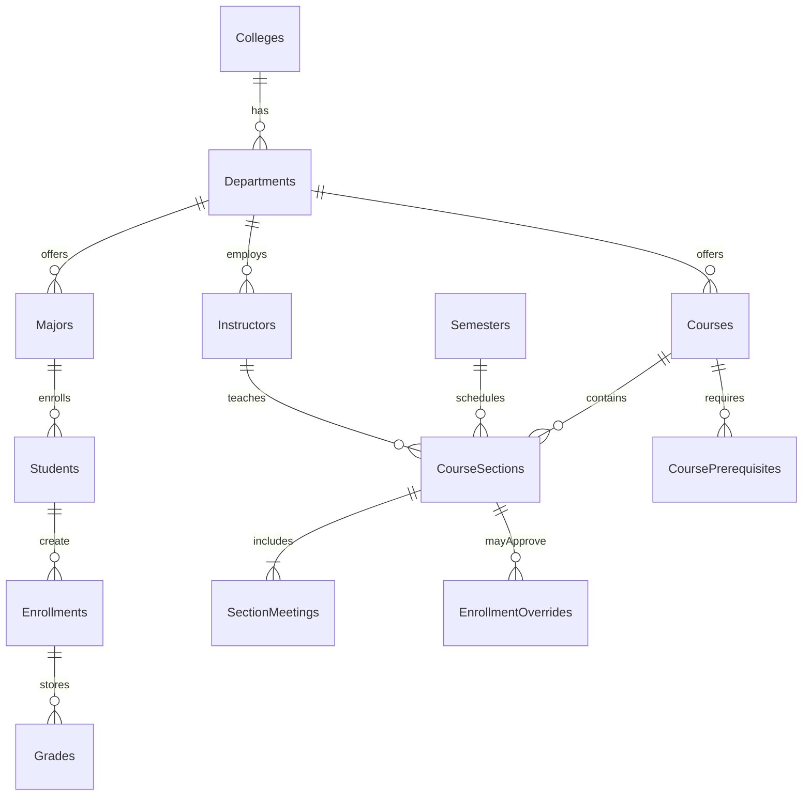

# University Course Registration and Grade Management Database Design

This document describes the schema, constraints, and operational guidelines for the University Course Registration and Grade Management Database System. The design targets a relational database such as PostgreSQL, MySQL, or SQL Server, using only ANSI SQL features when possible. A Django reference implementation that mirrors these entities lives in `registrar/` with seed data via `python manage.py bootstrap_demo` and a ready-to-use admin UI.

## Goals
- Centralize data for students, instructors, courses, sections, enrollments, prerequisites, and grades.
- Enforce core business rules in the schema through keys, checks, and reference tables.
- Support common workflows: registration, prerequisite validation, conflict detection, grade entry, GPA calculation, and transcript generation.
- Provide artifacts (DDL, seed data, and sample queries) to accelerate deployment and testing.

## Entity-Relationship Overview

## Table Specifications

### Reference Tables
- **colleges**: `college_id` (PK), `name`, `dean`, `contact_email`.
- **departments**: `department_id` (PK), `college_id` (FK), `name`, `office_location`, `contact_email`.
- **majors**: `major_id` (PK), `department_id` (FK), `name`, `degree_level`, `required_credits`.
- **semesters**: `semester_id` (PK), `code` (e.g., `2025FALL`), `name`, `start_date`, `end_date`, `add_deadline`, `drop_deadline`.
- **users**: `user_id` (PK), `username`, `password_hash`, `role` (`student` | `instructor` | `admin`), `created_at`, `status` (pending/approved/disabled). Students and instructors link back to this table to unify authentication.

### Core Entities
- **students**: `student_id` (PK), `user_id` (FK), `major_id` (FK), `college_id` (FK), `full_name`, `gender`, `date_of_birth`, `email`, `phone`, `address`, `enrollment_year`, `expected_graduation_year`, `gpa_cache` (optional denormalization).
- **instructors**: `instructor_id` (PK), `user_id` (FK), `department_id` (FK), `full_name`, `title`, `email`, `phone`, `office`, `status` (active/on_leave/retired). Department is immutable except via admin changes.
- **courses**: `course_id` (PK), `department_id` (FK), `course_code`, `name`, `credits`, `course_type` (general_required, major_required, major_elective, university_elective, practical), `description`, `repeatable` (boolean), `active`.
- **course_sections**: `section_id` (PK), `course_id` (FK), `semester_id` (FK), `instructor_id` (FK), `section_code` (e.g., `A01`), `capacity`, `waitlist_capacity`, `location_note`, `status` (planned/open/closed/cancelled), `language`, `grading_scheme` (numeric/letter/pass_fail), `created_at`.
- **section_meetings**: `meeting_id` (PK), `section_id` (FK), `day_of_week` (1=Mon), `start_time`, `end_time`, `room`, `building`. Time conflicts are detected on this table for both students and instructors.
- **course_prerequisites**: `course_id` (FK), `prereq_course_id` (FK), `min_grade` (letter or numeric threshold), `all_of` flag to support composite prerequisite logic. Composite logic can be implemented with AND over rows and an optional grouping field for OR branches.
- **enrollments**: `enrollment_id` (PK), `student_id` (FK), `section_id` (FK), `status` (enrolling, dropped, completed, failed, passed, retake_pending), `requested_at`, `approved_at`, `dropped_at`, `grade_mode` (normal/audit), unique constraint on (student_id, section_id).
- **grades**: `grade_id` (PK), `enrollment_id` (FK, unique), `numeric_grade`, `letter_grade`, `grade_points`, `recorded_at`, `recorded_by` (FK to `instructors`), `is_final`.
- **enrollment_overrides**: `override_id` (PK), `enrollment_id` (FK), `override_type` (capacity, prerequisite, time_conflict, retake), `approved_by` (FK to admins), `approved_at`, `reason`.

### Integrity Rules and Checks
- Unique IDs for students, instructors, courses, and users via primary keys.
- `enrollments.student_id` references `students` and cannot be duplicated per section.
- `course_sections.capacity` and `waitlist_capacity` must be non-negative; check constraints enforce `capacity >= 0`, `waitlist_capacity >= 0`.
- Instructor scheduling conflict prevention uses a constraint that no two `section_meetings` share the same instructor/time; enforced at application layer with the provided queries.
- Enrollment conflict prevention uses a similar time-overlap query between `section_meetings` joined to the student's current sections.
- Prerequisite validation uses `course_prerequisites` joined with historical `grades` where `grade_points` meet `min_grade` thresholds; failures block enrollment unless an override exists.

## Key Workflows

### Student Registration and Profile Maintenance
1. Admin approves `users` row with role `student`; creates `students` row referencing `majors` and `colleges`.
2. Students update contact info in `students` table fields such as `email`, `phone`, `address`.

### Course Scheduling and Enrollment
1. Admins create `courses`, `semesters`, and `course_sections`; add meeting times in `section_meetings` and capacities on `course_sections`.
2. Students submit enrollment requests. The application executes:
   - **Prerequisite check**: ensure required rows in `course_prerequisites` have passing grades on prior `courses`.
   - **Time conflict check**: compare requested section's `section_meetings` with existing enrolled sections for the same student.
   - **Credit load check**: sum planned credits for the student in the semester; reject outside 10–40 credit bounds.
   - **Capacity check**: ensure `enrollments` count below `capacity`;否则需要管理员干预或调整容量。
3. Admins may approve overrides in `enrollment_overrides`, e.g., retake permission for previously passed courses.

### Grading and GPA Calculation
1. Instructors record `grades` rows tied to their sections; `grades.grade_points` map to letter grades via policy (see sample mapping below).
2. Final grades update enrollment status to `passed` or `failed`.
3. GPA is computed as the weighted sum of `grade_points * course_credits` divided by total attempted credits; a cached GPA field on `students` can be refreshed via scheduled job.

#### Sample Grade Mapping
| Letter | Points |
| --- | --- |
| A | 4.0 |
| A- | 3.7 |
| B+ | 3.3 |
| B | 3.0 |
| B- | 2.7 |
| C+ | 2.3 |
| C | 2.0 |
| D | 1.0 |
| F | 0.0 |

## Indexing Strategy
- `courses(course_code)` unique index for fast lookup by catalog code.
- `course_sections(course_id, semester_id)` composite index for semester-based retrieval.
- `enrollments(student_id, section_id)` unique index to prevent duplicates and enable fast conflict detection.
- `section_meetings(section_id, day_of_week, start_time)` index to accelerate overlap checks.
- `grades(enrollment_id)` unique index because an enrollment has at most one final grade.
- `course_prerequisites(course_id, prereq_course_id)` composite PK for quick prerequisite verification.

## Security and Roles
- Use database roles mapped to application roles (student, instructor, admin) with least privilege.
- Implement row-level security policies where supported to restrict students to their own `enrollments` and `grades`.
- Store `password_hash` using strong algorithms (bcrypt/argon2) in `users`; never store plaintext.

## Transactions and Concurrency
- Wrap enrollment steps in transactions to ensure atomic conflict, capacity, and prerequisite checks.
- Use `SELECT ... FOR UPDATE` on `course_sections` when incrementing seat counts to avoid overbooking.
- When two students attempt the final seat, rely on transaction isolation (repeatable read/serializable) or optimistic retry logic.

## Data Quality and Auditing
- Timestamps (`created_at`, `recorded_at`, `approved_at`) track important mutations.
- Use `status` enums instead of free text to standardize workflow states.
- Add audit triggers to log grade changes to a `grade_audit` table when supported.

## Reporting and Exports
- Transcript export uses the transcript query in `sql/queries.sql` to pull completed courses, grades, and GPA.
- GPA distribution and pass-rate reports aggregate `grades` joined to `course_sections` by semester and course.
- Curriculum lookup filters `courses` by `course_type` and joins `majors` for required credit totals.

## Test Data Strategy
- Seed data in `sql/sample_data.sql` covers:
  - Normal enrollments, prerequisite failures, retake requests, and time conflicts.
  - Instructors with overlapping meeting times to test instructor conflict logic.
  - Mixed grade outcomes (pass/fail) for GPA calculations and prerequisite validation.

## Extension Ideas
- Add `buildings` and `rooms` tables with capacities for room scheduling.
- 自动化容量监控与调班：满额时提醒管理员调整容量或开设新班级。
- Provide REST or GraphQL endpoints for integration with a front-end or administrative portal.
- Add messaging/notification tables for enrollment approvals or prerequisite denials.

